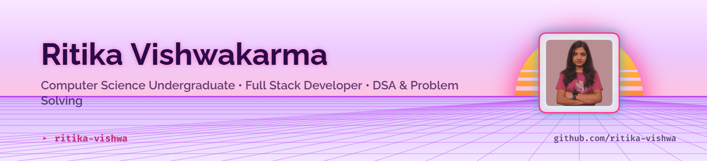

<!-- ========================= -->
<!--        PROFILE README     -->
<!-- ========================= -->

<picture>
  <source
    media="(prefers-color-scheme: dark)"
    srcset="art/header-dark.png"
  />
  <source
    media="(prefers-color-scheme: light)"
    srcset="art/header-light.png"
  />
  
</picture>

  

# Hey there, I'm **Ritika** 👋

 

---

# 💖 About Me

<table>
<tr>

<td width="65%" valign="top">

### Hi! I'm Ritika 👋

I'm a passionate Computer Science student who enjoys building impactful software, solving challenging problems, and continuously learning modern technologies.

✨ **A few things about me**

- 🌸 Currently working on exciting Full Stack projects
- 📚 Practicing Data Structures & Algorithms
- 🎯 Goal: Become a great Software Engineer
- 🌍 Love creating beautiful UI experiences
- ☕ Coffee + Code = Productivity

---

### Currently
- 🌱 Worked on: **Civic-Connect – Civic Issue Reporting & Community Engagement Platform**
- 📚 Learning: **DSA, Problem Solving & Backend Development**
- 🤝 Open to collaborate on **Full Stack Development Projects**
- 💬 Ask me about **React, Node.js, MongoDB, Java, C++ & Git**
- ⚡ Fun Fact: **I believe every great application starts with solving a real problem.**

</td>

<td width="35%" align="center">

</td>

</tr>
</table>

---

# 🛠 Tech Stack

---

# 📊 GitHub Analytics

 

---

# 📈 Contribution Activity

---

## 🐍 Contribution Snake

<picture>
  <source
    media="(prefers-color-scheme: dark)"
    srcset="https://raw.githubusercontent.com/ritika-vishwa/ritika-vishwa/output/github-contribution-grid-snake-dark.svg"
  />
  <source
    media="(prefers-color-scheme: light)"
    srcset="https://raw.githubusercontent.com/ritika-vishwa/ritika-vishwa/output/github-contribution-grid-snake.svg"
  />
  
</picture>

# 🌐 Connect With Me

---

### 💕 Thanks for visiting my profile!

*"Keep learning, keep building, and never stop creating."*

